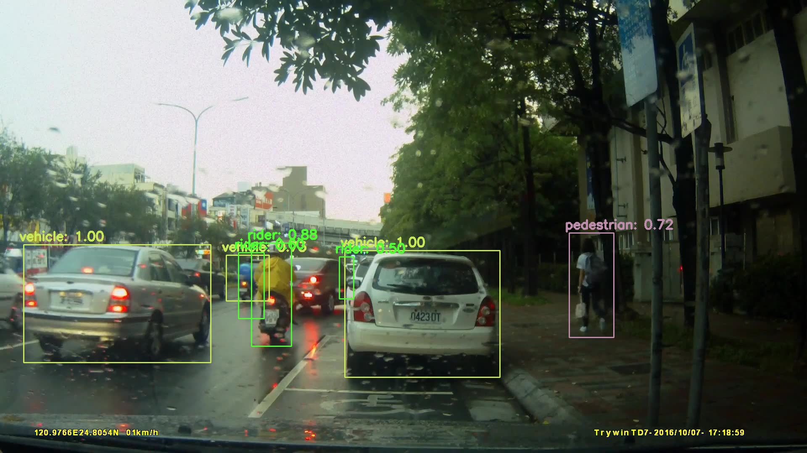
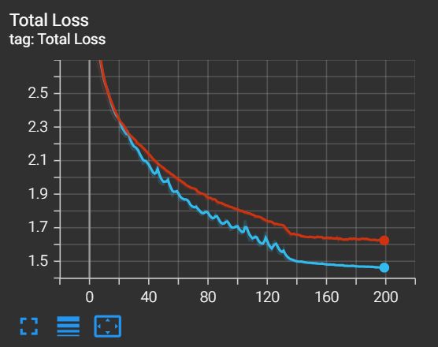

# UBI SSD by PyTorch

Object Detection with SSD on UBI Datasets.

### Results
1. Detection



2. Training log



### Dependencies
- Python 3.8
- OpenCV
- numpy
- PyTorch 1.10
- tensonflow 2.2.0
- tensorboard
- tqdm
- rknntoolkit 1.7.3

### Optional Model
- Vgg16-SSD
- MobileNet_V1-SSD
- MobileNet_V1-SSDLite
- MobileNet_V2-SSDLite

### Dataset Path
The dataset path should be structured as follow:
```
ubi
  |- UBI_Dataset -- All data (voc format)
  |            |- Annotations -- (.xml)
  |            |- JPEGImages -- (.jpg)
  |
  |- Data -- Split UBI_Dataset into train, test & valid by 7:1:2
  |
  |- UBI_SSD -- Model
                    |- Dataset
                    |- models
                    |- ...
                    |- train.py
                    |- ...
```

### Usage
1. Get dataset
```bashrc
mkdir ubi
cd ubi
git clone https://github.com/yue-723/UBI_Dataset.git
```
2. Get model
```bashrc
cd ..
git clone https://github.com/yue-723/UBI_SSD.git
```
3. Split dataset
```
notebook: /UBI_SSD/Dataset/generate_Data.ipynb
```

### Train
1. Train
```bashrc
python train.py --datasets <DATASET_PATH> --validation_dataset <VALIDSET_PATH> --net <NET_TYPE> --batch_size 64 --num_epochs 200 --scheduler cosine --lr 0.01 --t_max 200
```
2. Train pretrained-model
```bashrc
python train.py --datasets <DATASET_PATH> --validation_dataset <VALIDSET_PATH> --net <NET_TYPE> --pretrained_ssd models/${pretrained-model}.pth --batch_size 64 --num_epochs 200 --scheduler cosine --lr 0.01 --t_max 200
```
3. Simply run `train.sh`
```bashrc
./train.sh
```
### Resume Training
```bashrc
python train.py --datasets <DATASET_PATH> --validation_dataset <VALIDSET_PATH> --net <NET_TYPE> --resume models/${trained-model-name}.pth --batch_size 64 --num_epochs 200 --last_epoch ${last_epoch} --scheduler cosine --lr 0.001 --t_max 100 --debug_steps 10
```

### Test
1. Test on image
```bashrc
python test.py <IMG_PATH> <MODEL_WEIGHT_PATH> <MODEL_TYPE>
```

### Check on tensorboard
```bashrc
tensorboard --logdir runs
```

### Example args

1. Train pretrained-model
```bashrc
python train.py --datasets ../Data/train/ --validation_dataset ../Data/val/ --net mb2-ssd-lite --pretrained_ssd models/mb2-ssd-lite-net.pth --batch_size 64 --num_epochs 200 --scheduler cosine --lr 0.001 --t_max 200
```
2. Resume
```bashrc
python train.py --datasets ../Data/train/ --validation_dataset ../Data/val/ --net mb2-ssd-lite --resume models/best.pth --batch_size 64 --num_epochs 20 --scheduler cosine --lr 0.001 --t_max 200
```
3. Test
```bashrc
python test.py test_img.jpg models/best.pth mb2-ssd-lite
```

### Export model
```bashrc
python export.py
```
### Evaluate model
```bashrc
python eval_ssd.py ../Data/test/
```
### Convert to .rknn model
```bashrc
python convert2rknn.py
```
### Todo & issue
1. Cosine scheduler when resume training
2. MobileNet_V3-SSDLite
3. Enhance rider & pedestrian detection

### References
- https://github.com/qfgaohao/pytorch-ssd
- https://github.com/tranleanh/mobilenets-ssd-pytorch
